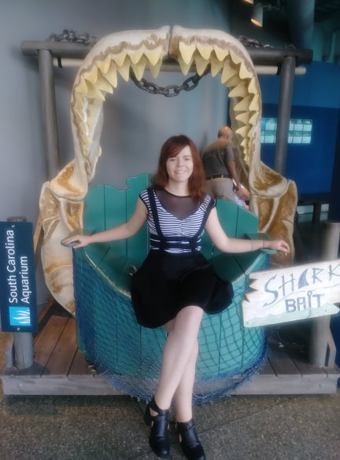

<link rel="stylesheet" href="styles.css" type="text/css">

  

Hello! My name is Alejandra and I am a genomics fellow in the marine biology program at the College of Charleston. I currently work as both a research assistant and teaching assistant, however I also have a part-time job working as a science educator at [Patriot's Point](https://www.patriotspoint.org/). 

My thesis work focuses mainly on the biogeography of deep-sea, iron oxidizing bacteria that are also capable of living in estuarine environments (in other words, I work with bacteria that can live in many different places and make rust.) If you are interested in learning more, check out my blog! I will be posting not only about my work but also about what it is like to be in grad school/be a marine biologist, so go check it out! My blog posts will also be available in Spanish!
.
.
.

¡Hola! Me llamo Alejandra, y estoy estudiando mi maestría en biologia marina con un enfoque en genómica en el Colegio de Charleston. Actualmente estoy trabajando como asistente de investigación y asistente de educación en el colegio. Cuando tengo tiempo, también trabajo como maestra de ciencia en [Patriot's Point](https://www.patriotspoint.org/). 

My tesis se enfoca principalmente en la biogeografía de las bacterias que oxidan hierro y que pueden sobrevivir en varios ecosistemas (en otras palabras, estudio microbios que oxiden fierro, muchas veces causando que se pudra. Estos microbios pueden vivir en muchas partes del mundo, incluso en estuarios). ¡Si quieres saber más, sigue mi blog donde escribo sobre mi tiempo como estudiante, como es la vida de una bióloga marina, y mi arte! También estará disponible en Ingles. 
